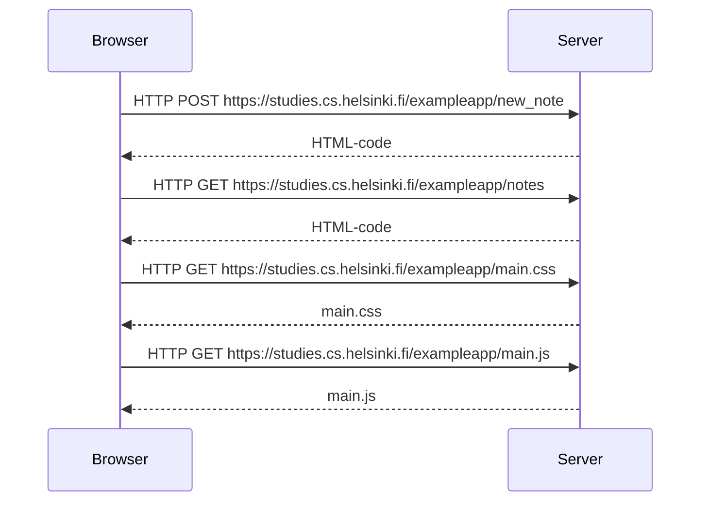

# Part 0 : Item 4 : new note (Course Full Stack open 2022)

```mermaid
sequenceDiagram
    participant Browser 
    participant Server
    Browser->>Server: HTTP POST https://studies.cs.helsinki.fi/exampleapp/new_note 
    Server-->>Browser: HTML-code 
    Browser->>Server: HTTP GET https://studies.cs.helsinki.fi/exampleapp/notes
    Server-->>Browser: HTML-code
    Browser->>Server: HTTP GET https://studies.cs.helsinki.fi/exampleapp/main.css
    Server-->>Browser: main.css
    Browser->>Server: HTTP GET https://studies.cs.helsinki.fi/exampleapp/main.js
    Server-->>Browser: main.js
```
